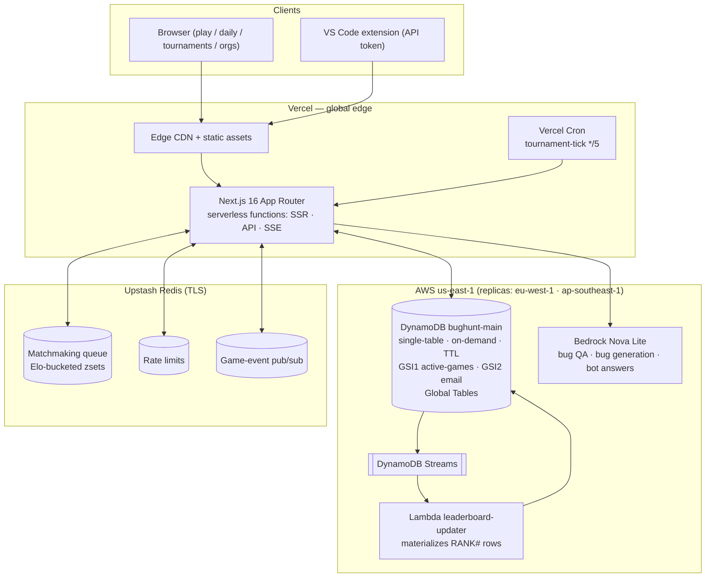

# BugHunt — Competitive Debugging Game

> Race to find bugs in code faster than your opponent. Climb the Elo ladder. Become the Grandmaster.

[Live Demo](https://bughunt.vercel.app) · [Demo Video](#) · [Architecture](#architecture)

## What is BugHunt?

BugHunt is a competitive debugging platform — chess.com, but for finding bugs. Two players are matched
and race through the same 3 buggy code snippets (one per round, 120s each); most correct answers wins,
with total time as the tiebreak, and the winner takes Elo points. Beyond
1v1 ranked play, BugHunt also has daily challenges, practice mode, tournaments with brackets, org/team
leaderboards, a social layer (follow, feed, direct challenges), notifications, post-game chat, rematches,
and community bug submissions with AI-assisted quality filtering.

## Features

- **Ranked 1v1 Matchmaking** — Redis-backed Elo queue pairs you with an opponent near your rating
- **50 Hand-Crafted Bugs** — across Python, JavaScript, TypeScript, Go, SQL, and Bash, seeded via `npm run db:seed`
- **Daily Challenge** — One shared bug per day, with a historical archive
- **Practice Mode** — Solo play against random bugs, no Elo at stake
- **Tournaments** — Bracket-style tournaments with automated round advancement (cron-driven)
- **Orgs / Teams** — Create or join an org, invite members, compete on an org leaderboard
- **Social** — Follow players, see a feed of games from people you follow, send/accept direct challenges
- **Notifications** — Real-time via Server-Sent Events (SSE)
- **Post-Game Chat** — Limited chat (5 messages per player) after a match resolves
- **Rematch** — Send a rematch intent to your last opponent (60s TTL) and auto-create a new game on mutual accept
- **Elo Rating System** — Chess-style K-factor ratings with rank tiers (Bronze → Grandmaster) and seasonal leaderboards
- **Community Bug Submissions** — Players submit bugs; Amazon Bedrock Nova screens them for quality before admin review
- **Admin Panel** — Moderate community submissions, generate bugs with Bedrock, view system health
- **VS Code Extension** — Practice bugs from your editor via a personal API token
- **Shareable Results** — Auto-generated OG images for match results (`@vercel/og`)

## Tech Stack

| Layer | Technology |
|---|---|
| Framework | Next.js 16.2 (App Router, Turbopack) |
| Auth | NextAuth v5 beta (Google + GitHub OAuth) |
| Database | Amazon DynamoDB — single-table design (`bughunt-main`) |
| Cache / Queue / Pub-Sub | Upstash Redis (matchmaking queue, rate limiting, game event pub/sub) |
| AI | Amazon Bedrock Nova (community bug quality filter, admin bug generation) |
| Hosting | Vercel |
| OG Images | `@vercel/og` |
| UI | React 19, Tailwind CSS v4, `@base-ui/react` |
| Language | TypeScript |

## Architecture

See [docs/ARCHITECTURE.md](docs/ARCHITECTURE.md) for access patterns, capacity math, and known limits.



**Notes on the design:**
- **DynamoDB is the single source of truth** for everything (users, games, bugs, tournaments, orgs, etc.) using a single-table design — see schema below.
- **Upstash Redis** backs the live matchmaking queue (sorted sets bucketed by Elo), rate limiting, and game-event pub/sub. The waiting player polls `/api/game/matchmake` every 3s; once matched, both clients open an SSE stream.
- **Gotcha:** the `@upstash/redis` HTTP client has no `subscribe` method. The game SSE stream (`/api/game/stream`) instead uses `src/lib/redis-sub.ts`'s `ioredis` TCP subscriber (`REDIS_URL`) for push, with a 10s safety poll; the notifications stream still uses `@upstash/redis` and falls back to **DynamoDB polling every 2s** when pub/sub isn't available — this is expected, not a bug.
- **DynamoDB Global Tables are enabled**: `bughunt-main` replicates to eu-west-1 and ap-southeast-1 (`scripts/enable-global-tables.sh` for fresh deployments). `src/lib/dynamodb.ts` maps known European/Asian `VERCEL_REGION` values to the nearest replica for reads (falling back to us-east-1 elsewhere); writes are pinned to us-east-1 while Vercel functions run single-region — see docs/ARCHITECTURE.md, Limit 4, for the honest multi-region write story.

## DynamoDB Single-Table Schema

Table: `bughunt-main` (default name, configurable via `DYNAMODB_TABLE_NAME`) — on-demand capacity.

| PK | SK | Entity |
|---|---|---|
| `USER#<userId>` | `PROFILE` | User profile |
| `USER#<userId>` | `FOLLOWS#<followeeId>` | Follow edge (who I follow) |
| `USER#<userId>` | `FOLLOWER#<followerId>` | Reverse follow index (who follows me) |
| `USER#<userId>` | `NOTIF#<ts>#<id>` | Notification |
| `USER#<userId>` | `HISTORY#<ts>#<gameId>` | Match history entry |
| `USER#<userId>` | `CHALLENGE_SENT#<id>` | Direct challenge sent index |
| `USER#<userId>` | `CHALLENGE_RECV#<id>` | Direct challenge received index |
| `GAME#<gameId>` | `META` | Game record (`gsi1pk = ACTIVE_GAME#player1Id`) |
| `GAME#<gameId>` | `ACTIVE_PLAYER#<p2Id>` | Tracks player2's active game (`gsi1pk = ACTIVE_GAME#player2Id`) |
| `GAME#<gameId>` | `CHAT#<ts>#<userId>` | Post-game chat message |
| `GAME#<gameId>` | `ANSWER#<userId>` | Player's submitted answer |
| `BUG#<bugId>` | `META` | Bug record |
| `BUG#INDEX` | `META` | List of active bug IDs (`bugIds[]`) |
| `DAILY#<date>` | `META` | Daily challenge record |
| `DAILY#<date>` | `ENTRY#<userId>` | User's daily submission |
| `CHALLENGE#<id>` | `META` | Direct challenge |
| `TOURNAMENT#<id>` | `META` | Tournament |
| `ORG#<id>` | `META` | Org |
| `REMATCH#<uid>` | `<opponentId>` | Rematch intent (60s TTL) |

> The matchmaking queue is **not** stored in DynamoDB — it lives entirely in Upstash Redis as
> Elo-bucketed sorted sets (see Architecture above).

## Setup

### Prerequisites

- Node.js 18+
- AWS account with DynamoDB + Bedrock access
- Upstash Redis instance (REST + TLS URL)
- Google + GitHub OAuth apps

### Environment Variables

```bash
AWS_REGION=us-east-1
AWS_ACCESS_KEY_ID=your-key
AWS_SECRET_ACCESS_KEY=your-secret

NEXTAUTH_URL=http://localhost:3000
NEXTAUTH_SECRET=generate-with-openssl-rand-base64-32

GOOGLE_CLIENT_ID=...
GOOGLE_CLIENT_SECRET=...
GITHUB_CLIENT_ID=...
GITHUB_CLIENT_SECRET=...

ADMIN_EMAILS=your@email.com          # comma-separated, gates /admin routes

DYNAMODB_TABLE_NAME=bughunt-main      # optional, this is the default

REDIS_URL=rediss://...                # Upstash TLS URL
UPSTASH_REDIS_REST_URL=https://...upstash.io
UPSTASH_REDIS_REST_TOKEN=...

CRON_SECRET=...                       # Bearer token required by /api/cron/* routes
BEDROCK_REGION=us-east-1              # optional, this is the default
```

### Install & Run

```bash
npm install
npm run db:create        # Create the DynamoDB table
npm run db:seed          # Seed the bug bank
npm run db:seed-season   # Create the first leaderboard season
npm run dev              # Start the dev server (Turbopack)
```

### Deploy to Vercel

```bash
vercel --prod
```

Set all the environment variables above in the Vercel dashboard. Then run `npm run db:create` and
`npm run db:seed` against your production table (or point your local env at it).

### (Optional) Enable Global Tables

`scripts/enable-global-tables.sh` will add cross-region replicas to `bughunt-main` for a multi-region
demo. It is **not** required — and not run automatically — for the app to work; it's a manual,
optional step that needs AWS CLI credentials with replication permissions.

```bash
./scripts/enable-global-tables.sh
```

## Testing

| Suite | What it covers | Command |
|---|---|---|
| Unit | Elo math, rank tiers, bug logic, seasons, game resolution, Redis helpers (42 tests) | `npm run test:unit` |
| API integration | All API routes against a real DynamoDB table with `TEST_MODE=true` (~100 tests) | `npm run test:api` |
| End-to-end | Full user flows via Playwright (37 tests) | `TEST_MODE=true npx playwright test` |
| Everything | Unit + API | `npm test` |

Tests authenticate via the `x-test-user-id` header (API tests) or `test-user-id` cookie (E2E) — see
`getTestSession` / `getTestSessionFromCookies` in `src/lib/test-auth.ts`. Any new route must support
this fallback to be testable.

```bash
npm run test:unit                       # 42 unit tests
npm run test:api                         # ~100 API integration tests (real DynamoDB, TEST_MODE=true)
TEST_MODE=true npx playwright test       # 37 E2E tests (requires dev server running with TEST_MODE=true)
```

## Demo Script (3 minutes)

1. **Hook** (0:00–0:15) — "What if debugging was competitive?"
2. **Login** (0:15–0:35) — Sign in with Google/GitHub
3. **Matchmaking** (0:35–1:05) — Click "Find Match", get paired via the Redis-backed Elo queue
4. **Gameplay** (1:05–1:50) — Read the code, pick the bug, timer counts down, opponent's progress streams in live
5. **Result + Elo** (1:50–2:10) — Win/loss banner, Elo change, bug explanation, share card
6. **Beyond 1v1** (2:10–2:40) — Daily challenge, tournaments bracket, org leaderboard, social feed
7. **Architecture** (2:40–3:00) — DynamoDB console, Upstash Redis dashboard, Vercel deployment

## Hackathon Info

- **Event:** H0 Hackathon — Vercel + AWS Databases
- **Track:** Track 3 — Million-scale global app (gaming/social/entertainment)
- **Team:** Mohamed Sorour ([@mohamedsorour1998](https://github.com/mohamedsorour1998))

## License

MIT
